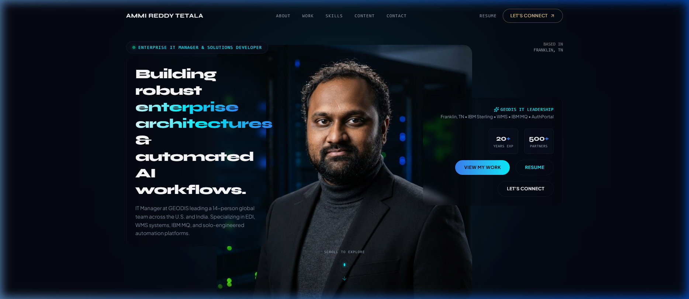
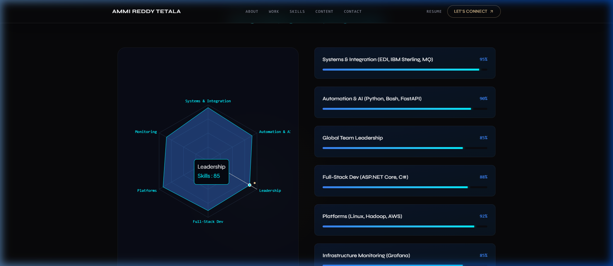

# Ammi Reddy Tetala — Enterprise IT & AI Solutions Portfolio

A high-end, interactive portfolio designed to showcase 20+ years of enterprise IT leadership, architecture, and AI-driven solutions development. 

This project was built with a deep focus on **"Awwwards"-level aesthetics**, featuring a dark cyber-enterprise theme, fluid animations, and data-driven visualization.

## 📸 Showcase

### Hero Section & Particle Background


*The Hero section features an interactive constellation of particles (`react-tsparticles`) that reacts to cursor proximity, paired with magnetic glassmorphism CTA buttons.*

### Technical Mastery & Radar Chart


*A data-driven approach to showcasing skills using a responsive glowing Radar Chart (`recharts`) and 3D tilt-tracking skill cards (`framer-motion`).*

---

## ✨ Key Features & Interactions

- **360° Real Photo Turntable Engine:** Pinned GSAP ScrollTrigger canvas that smoothly rotates through 32 high-resolution photographic turnaround frames of Ammi.
- **AI Chatbot Clone:** Intelligent floating assistant equipped with fast-path FAQ and Vercel serverless Gemini AI proxy (`api/chat.ts`) keeping secrets completely server-side. Highlighted by an animated callout and bouncing arrow.
- **Google Calendar Direct Booking:** Instant 30-minute conversation scheduling via Google Calendar appointment system (`https://calendar.app.google/FkHk6NzDGzwhXEBn8`).
- **Recruiter Perspective Toggle:** Switch between "Enterprise IT Leader" and "AI Architect" perspectives in real time.
- **Live Activity Ticker:** Dynamic ticker tracking active enterprise infrastructure and AI projects.
- **Particle Background:** A floating constellation effect that reacts to cursor movement and clicks, cementing a "cyber/AI" aesthetic.
- **Magnetic UI Buttons:** Primary call-to-action buttons physically pull towards the user's cursor on hover for a tactile, luxury-web feel.
- **3D Tilt Cards:** Skill cards and project showcases apply 3D `rotateX` and `rotateY` transforms based on mouse position.
- **Data Visualization:** A responsive glowing radar chart that visualizes technical competencies across AI, Enterprise Architecture, Cloud, and Data.
- **Live Media Analytics & Growth Chart:** Interactive Recharts area chart with multi-metric toggles, synced directly from Google Drive daily telemetry JSON (`ammi_explain_daily.json` & Archive, 43 consecutive daily snapshots).
- **Verified Career Timeline:** Accurate chronological timeline matching resume across GEODIS (IT Manager, Technical Lead, EDI Analyst) and AT&T (Hadoop Administrator).

## 🚀 Live Demo & Portal Details

To view the live demo, run the following commands to start the local development server:

```bash
# Install dependencies
npm install

# Start the development server
npm run dev
```

The site will be available at `http://localhost:5173`.

## 🛠️ Technology Stack

- **Framework:** React 19 + TypeScript + Vite
- **Styling:** Tailwind CSS (Custom dark cyber theme with glassmorphism)
- **Animations:** GSAP, ScrollTrigger, Framer Motion, Lenis Smooth Scroll, React-TSParticles
- **Data Visualization:** Recharts
- **Icons:** Lucide React
- **Serverless Backend:** Vercel Functions (`api/chat.ts`) for secure Gemini AI queries

## 👨‍💻 About Ammi Reddy Tetala

I am an **Enterprise IT Manager** (GEODIS) and **Solutions Developer** with over 20 years of experience bridging legacy infrastructure with modern intelligent automation. I architect secure, scalable integrations and build AI-powered applications that drive business value.

- **LinkedIn:** [linkedin.com/in/ammireddytetala](https://www.linkedin.com/in/ammireddytetala/)
- **YouTube:** [@ammiexplains](https://www.youtube.com/@ammiexplains)
- **GitHub:** [github.com/ammiforu](https://github.com/ammiforu)
- **Focus Areas:** Enterprise Architecture, Generative AI (LLMs, RAG), Cloud Infrastructure (GCP, Azure, AWS), and Data Engineering.
- **Notable Projects:** AuthPortal (Enterprise IAM), YouTube AI Agent (Content Automation), EDI & IBM MQ Infrastructure Integrations.
